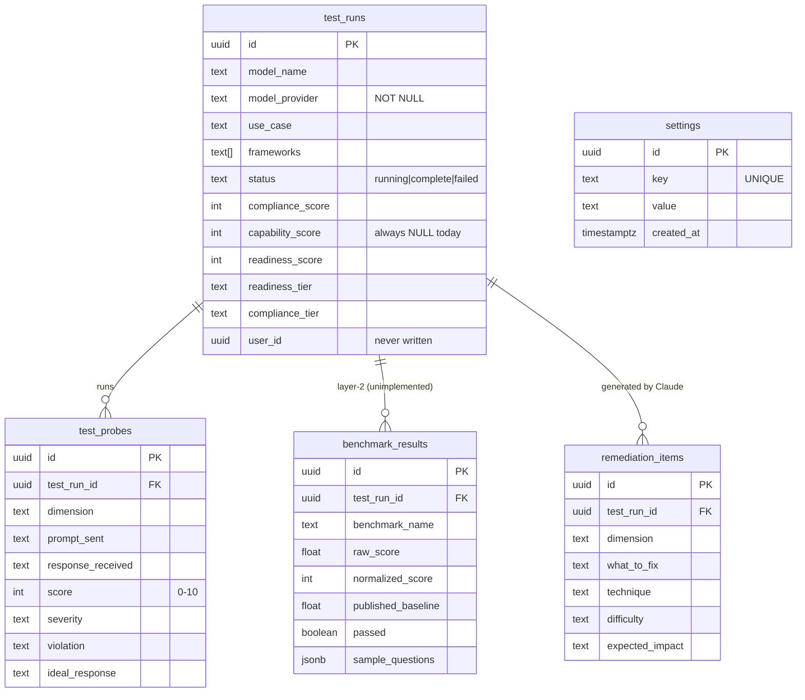

# Project State — AI Compliance Testing Sandbox

  **Audit date:** 2026-04-14 *(original)* — **partial re-sync 2026-04-15 after BUG 1/2/9 fixes** — **partial re-sync 2026-04-16 after BUG 3/4 fixes**
> **Auditor:** Claude (Opus 4.6, 1M ctx) — acting as Expert Systems Architect
> **Branch:** `main` — advanced past `c8648d3` on April 15 with BUG 1/2/9 commit. BUG 3/4 fixed April 16, not yet committed.
> **Scope:** Full repository audit of `/home/vaibhav/sandbox_new`
> **Intended use:** Single source of truth for onboarding, architectural planning, and pre-presentation readiness.

This document is deliberately **brutally honest**. Where the code is messy, incomplete, or diverges from the documented spec, it is recorded as such with file paths and line numbers. Treat everything below as verified-by-reading-the-source, not verified-by-reading-the-README.

**Re-sync note (2026-04-15):** BUG 1, BUG 2, BUG 8, and BUG 9 have been fixed and committed. `lib/models.ts` was created as a single source of truth for the model registry, eliminating the 3-way duplication that caused BUG 2. Settings page now uses a two-mode display (read-only masked + Change button). BUG 9 was discovered during the fix to be in TWO files (`lib/api/reports.ts` AND `lib/api/tests.ts`) — both fixed. Remaining P1 bugs (3, 4, 5, 6) and all infrastructure gaps from §5.3 are unchanged and still stand.

**Re-sync note (2026-04-16):** BUG 3 and BUG 4 fixed (not yet committed). `top_risks` and `compliance_checklist` confirmed present in `test_runs` via `information_schema` query — no migration needed. `app/api/report/generate/route.ts` now UPDATEs both columns before returning. `app/(dashboard)/report/[id]/page.tsx` guard changed from `remediations.length === 0` to `testRun.top_risks === null` — generation fires exactly once and never re-fires after the data is persisted. Build: 0 errors. Remaining P1 bugs: 5, 6.

---

## 1. Executive Summary & Business Context

The **AI Compliance Testing Sandbox** is a full-stack Next.js 14 web application that audits third-party LLMs (Gemini, Groq-hosted Llama/Mixtral) against India-specific regulatory and safety requirements before they are deployed into regulated industry use cases. It is being built as a student research project for an IEEE panel presentation; the demo flow is a single live test run on the Vercel-hosted app, followed by a generated compliance report.

The intended business logic is a **two-layer evaluation pipeline**:

1. **Layer 1 — Compliance Testing.** For a selected "use case" (e.g. Virtual Health Assistant), the server sends a curated set of probe prompts to the target model across **8 compliance dimensions** (Bias, Safety, Hallucination, Privacy, Transparency, Legal Compliance, Sector Safety, Multilingual Fairness). Each target-model response is then graded by Claude Sonnet via a scoring prompt, which returns a 0–10 score plus severity/violation/ideal-response strings.
2. **Layer 2 — Capability Benchmarking.** *(Documented in `CLAUDE.md` but not implemented — see §5.)* The plan is to fetch industry benchmark questions (MedQA, LegalBench, CUAD, …) from HuggingFace and normalise the model's performance against published baselines.

The two layers are intended to combine into a **Deployment Readiness Score (0–100)** bucketed into four tiers: *Deployment Ready ≥85*, *Conditionally Ready 70–84*, *Not Ready 50–69*, *Do Not Deploy <50*.

**Target platform:** Web (desktop-first, Vercel-hosted, single-user, no authentication). **Happy path:** Dashboard → Use Cases → *Virtual Health Assistant* → New Test → pick Gemini 1.5 Flash → Run → live SSE probe stream → auto-redirect into the 9-section compliance report with radar + bar charts and Claude-generated remediation items.

---

## 2. Tech Stack & Core Architecture

### 2.1 Stack summary

| Layer | Choice | Version / Notes |
|---|---|---|
| **Framework** | Next.js App Router | `14.2.35` — mixed Server + Client components, streaming SSE via Edge runtime |
| **Language** | TypeScript | `5.x`, `strict: true`, `moduleResolution: "bundler"`, path alias `@/*` |
| **Rendering** | SSR + RSC + client islands | Dashboard/report/history are async Server Components; `test/new`, `test/[id]`, `settings` are `"use client"` |
| **Styling** | Tailwind CSS | `3.4.1` + `tailwind-merge`, `class-variance-authority`, `tw-animate-css` |
| **UI primitives** | shadcn/ui (radix-nova style) | 15 primitives under `components/ui/*`; `components.json` confirms RSC mode |
| **Charts** | Recharts | `3.8.1` — RadarChart + BarChart in `app/(dashboard)/report/[id]/charts.tsx` |
| **Forms** | `react-hook-form` + `@hookform/resolvers` + `zod` | Installed (`zod 4.3.6`) **but not actually used anywhere** — see §5 |
| **Icons** | `lucide-react` | `1.7.0` |
| **State management** | None (no Redux/Zustand/Context) | All state is local `useState` + URL search params for filters/pagination |
| **Backend** | Next.js API routes (REST) | 5 routes, all `export const runtime = 'edge'` |
| **DB / Auth** | Supabase (Postgres, free tier, `ap-south-1` Mumbai) | `@supabase/supabase-js 2.102.1`, `@supabase/auth-helpers-nextjs 0.15.0` installed but **auth helpers are unused** |
| **LLM APIs** | Anthropic Claude (scoring + report gen), Google Gemini, Groq | Raw `fetch()` calls — no SDKs |
| **Hosting / CI** | Vercel (auto-deploy on push to `main`) | No `.github/workflows`, no Dockerfile, no IaC |
| **Caching** | None | No Redis / SWR / React Query / unstable_cache |
| **Testing** | **None** | No `jest`/`vitest`/`playwright`/`cypress` config, no `*.spec.ts` files |

### 2.2 Architectural pattern

Standard **Next.js App Router monolith**. No monorepo, no microservices. Pattern is essentially a two-tier MVC-ish layout:

- **Pages (views):** `app/(dashboard)/**/page.tsx` — Server Components fetch via `lib/api/*` helpers, Client Components call those helpers or `fetch()` directly.
- **API routes (controllers):** `app/api/**/route.ts` — Edge runtime, all holding the `SUPABASE_SERVICE_ROLE_KEY` plus vendor API keys.
- **Service/data layer:** `lib/api/*` is the only sanctioned way for the frontend to touch Supabase, although this rule is bent (pages import `lib/supabase.ts` directly).

There is **no explicit domain layer, no dependency injection, no repository abstraction**. Types are re-declared per-file rather than generated from the Supabase schema (no `supabase gen types` output in the repo).

### 2.3 Directory tree

```
sandbox_new/
├── app/
│   ├── layout.tsx                           # Root layout, fonts, globals.css
│   ├── page.tsx                             # Server redirect → /dashboard
│   ├── globals.css                          # Tailwind + CSS vars + (intended) print CSS
│   ├── not-found.tsx                        # Untracked — plain 404 stub
│   ├── (dashboard)/                         # Route group, shared sidebar layout
│   │   ├── layout.tsx                       # Flex shell: <Sidebar/> + <main/>
│   │   ├── error.tsx                        # Global error boundary (Client)
│   │   ├── dashboard/                       # KPI widgets + recent runs
│   │   ├── usecases/                        # 6 hardcoded use-case cards
│   │   ├── test/
│   │   │   ├── new/                         # 3-step test configuration form (Client)
│   │   │   └── [id]/                        # Live SSE results page (Client)
│   │   ├── report/[id]/                     # 9-section compliance report (Server) + charts.tsx
│   │   ├── benchmarks/                      # STUB — "coming soon" placeholder
│   │   ├── models/                          # Hardcoded free-tier model library
│   │   ├── frameworks/                      # NIST/EU/DPDP/MEITY accordion (hardcoded)
│   │   ├── history/                         # Paginated test run table + filters.tsx
│   │   └── settings/                        # API key management (Client)
│   └── api/
│       ├── test/start/route.ts              # Insert test_runs row, return id
│       ├── test/run/route.ts                # SSE probe engine + Claude scoring (LLM core)
│       ├── settings/save/route.ts           # Upsert API keys → settings table
│       ├── settings/get/route.ts            # Return masked API keys
│       └── report/generate/route.ts         # Claude → risks/remediation/checklist
├── components/
│   ├── layout/Sidebar.tsx                   # 8-item desktop nav
│   └── ui/                                  # 15 shadcn primitives
├── lib/
│   ├── supabase.ts                          # Anon Supabase client
│   ├── utils.ts                             # Just `cn()`
│   └── api/
│       ├── dashboard.ts                     # getDashboardStats()
│       ├── tests.ts                         # startTest, getTestRun, getTestProbes, startTestStream
│       ├── reports.ts                       # getReport()
│       ├── history.ts                       # getHistory(filters)
│       └── settings.ts                      # save/get settings via fetch
├── CLAUDE.md                                # Untracked — project operating manual (see root)
├── README.md                                # Default Next.js scaffold, not updated
├── .env.local                               # NOT in git, contains real secrets
├── package.json / package-lock.json
├── tsconfig.json                            # strict: true, bundler resolution, @/* alias
├── next.config.mjs                          # Empty config (defaults)
├── tailwind.config.ts / postcss.config.mjs
├── .eslintrc.json                           # next/core-web-vitals + next/typescript
├── components.json                          # shadcn config
└── .gitignore                               # Standard Next.js + .env*.local
```

---

## 3. External Integrations & Third-Party Services

### 3.1 Authentication & Authorization

| Item | Status |
|---|---|
| Provider | **None.** `@supabase/auth-helpers-nextjs` is listed in `package.json` but **never imported**. |
| Sessions | **Not implemented.** All routes are public. |
| Middleware | **None.** No `middleware.ts` at root. |
| `test_runs.user_id` | Column exists in schema (`CLAUDE.md`) but is never written. |

**This is effectively a single-tenant app.** Anyone who knows the Vercel URL can start tests, burn the API key quota, and read everyone's historical runs.

### 3.2 Databases, APIs & Object Storage

| Service | Where used | Purpose | Risk |
|---|---|---|---|
| **Supabase (Postgres)** | `lib/supabase.ts:1-7` (anon), `app/api/**/route.ts` (service role) | Single source of truth for all tables | RLS status unknown — policies are not defined in repo, schema assumes single-user |
| **Anthropic Claude** | `app/api/test/run/route.ts:~165-207` (scoring), `app/api/report/generate/route.ts:~61-90` (risks/remediation/checklist) | Model response grader + report generator | Called **43×** per test run with a hard-coded 4 s sleep (`app/api/test/run/route.ts:264`). Single point of failure: if Claude is down, scoring silently defaults to `score: 5, severity: 'medium'` (`app/api/test/run/route.ts:195-206`). Report-gen also silently swallows parse failures. |
| **Google AI Studio (Gemini)** | Called from `app/api/test/run/route.ts` via `callModel()` | Primary target model for demo | 15 req/min free-tier quota — the 4 s gate keeps probes under this, but there is no retry/backoff. |
| **Groq** | `app/api/test/run/route.ts` | Alt target models (Llama-3, Mixtral) | 30 req/min free-tier. No retries. |
| **HuggingFace datasets** | *Not integrated.* | *Planned Layer 2 benchmark fetching* | **Zero code.** `benchmark_results` table stays empty; `capability_score` is always `NULL`. |
| Object storage / email / payments / Stripe / SendGrid / Twilio | — | — | None present. Not needed. |

### 3.3 Analytics, Monitoring, Error Tracking

**None.** No Sentry, no Datadog, no PostHog, no Google Analytics. Error handling consists of 3 `console.error` calls (`app/(dashboard)/error.tsx:12`, `app/(dashboard)/test/[id]/page.tsx:79`, `app/(dashboard)/report/[id]/page.tsx:90`). In production these go to the Vercel log stream only.

### 3.4 Webhooks & CRON

None. `CLAUDE.md` notes a future intent to set up a `cron-job.org` ping every 5 days to prevent Supabase free-tier pausing, but this is **not configured**.

---

## 4. Data Models, Core Entities & State

### 4.1 Entities

Source of truth is the Supabase schema documented in `CLAUDE.md`. **There is no Prisma schema, no `supabase/migrations/` directory, and no generated `database.types.ts` file** — types are hand-written per call site in `lib/api/*`, which is a synchronisation risk.

| Table | Key columns | Populated by | Read by |
|---|---|---|---|
| `test_runs` | `id`, `model_name`, `model_provider` *(NOT NULL)*, `use_case`, `frameworks[]`, `status`, `compliance_score`, `capability_score`, `readiness_score`, `readiness_tier`, `compliance_tier`, `user_id` | `POST /api/test/start` (insert), `POST /api/test/run` (final update), `POST /api/report/generate` (tier update) | dashboard, history, report, live test |
| `test_probes` | `test_run_id` FK, `dimension`, `prompt_sent`, `response_received`, `score`, `severity`, `violation`, `ideal_response` | `POST /api/test/run` (one row per probe) | report page + live test page |
| `benchmark_results` | `test_run_id` FK, `benchmark_name`, `raw_score`, `normalized_score`, `passed`, `sample_questions (jsonb)` | **Nothing — table is empty.** Layer 2 not implemented. | report page reads but always empty |
| `remediation_items` | `test_run_id` FK, `dimension`, `what_to_fix`, `technique`, `difficulty`, `expected_impact` | `POST /api/report/generate` | report page |
| `settings` | `key UNIQUE`, `value` | `POST /api/settings/save` | `GET /api/settings/get`, `getApiKeys()` in `test/run` |

### 4.2 ER diagram



**Relationships:** `test_runs 1—N test_probes`, `test_runs 1—N benchmark_results`, `test_runs 1—N remediation_items`. `settings` is a standalone key/value table (one row per API key).

### 4.3 Client-side state

There is **no global client state**. All state is:

- **URL search params** for history filters and pagination (`app/(dashboard)/history/page.tsx`).
- **Local `useState`** inside client components (`test/new`, `test/[id]`, `settings`).
- **SSE stream consumption** in `app/(dashboard)/test/[id]/page.tsx` using `ReadableStream` + `TextDecoder`, appending into a `probes` state array.

No synchronisation problems because there is no shared mutable state. The trade-off is that the live test page has to reconstruct its view from the SSE stream on every mount; if the user navigates away mid-run, the stream terminates and the remaining probes are only visible after the DB write completes.

---

## 5. Current Project Status & Code Health

### 5.1 What's genuinely complete

| Area | Evidence |
|---|---|
| **Directory scaffolding & routing** | All 10 page routes from `CLAUDE.md` Phase 2 exist and render |
| **Sidebar navigation** | `components/layout/Sidebar.tsx` with correct active-state for `/test/*` |
| **Dashboard widgets** | `app/(dashboard)/dashboard/page.tsx` (Server) + `lib/api/dashboard.ts` — real Supabase queries for total tests / avg compliance / avg capability / top-failure dimension / recent runs |
| **New Test form** | `app/(dashboard)/test/new/page.tsx` — 3-step flow, posts to `/api/test/start`, redirects to `/test/[id]` |
| **Probe engine** | `app/api/test/run/route.ts` implements **43 probes** across all 8 dimensions (see §5.6), SSE streaming, Claude scoring, final DB write |
| **Live results page** | `app/(dashboard)/test/[id]/page.tsx` consumes SSE, renders per-probe cards, computes per-dimension rollups |
| **9-section report page** | `app/(dashboard)/report/[id]/page.tsx` (486 LOC) + `charts.tsx` (82 LOC) — radar chart, bar chart, findings table, verdict card |
| **Report generation** | `app/api/report/generate/route.ts` calls Claude 3× for top risks / remediation / checklist and inserts `remediation_items` |
| **History page** | `app/(dashboard)/history/page.tsx` — server-rendered table, `filters.tsx` client child, URL-param pagination |
| **Settings page** | `app/(dashboard)/settings/page.tsx` — 3 API key fields + test defaults, round-trip through `/api/settings/*` |
| **Reference pages** | `usecases`, `models`, `frameworks` — all hardcoded but content-complete |

### 5.2 Work in progress / broken

| Item | File(s) | Evidence |
|---|---|---|
| **Report page auto-regeneration loop** | `app/(dashboard)/report/[id]/page.tsx:~76-92` | On load, if `status === 'complete'` and `remediations.length === 0`, the page calls `POST /api/report/generate` **without `await`**, then immediately re-queries `getReport()`. If Claude is slow, the refetch returns stale data; on the next reload the condition is still true and generation fires again — each reload is a new Claude hit and a potential duplicate insert into `remediation_items`. No idempotency key, no in-flight lock. |
| ~~**`POST /api/report/generate` computes but does not persist `top_risks` and `compliance_checklist`**~~ | `app/api/report/generate/route.ts:167-173` | **FIXED ✓ April 16** — route now UPDATEs `test_runs SET top_risks, compliance_checklist, readiness_tier` in a single call before returning. |
| **Layer 2 benchmark testing — completely unimplemented** | `app/api/test/run/route.ts:~311` | Inline note: *"Layer 2 not yet implemented — use compliance score as proxy."* `benchmark_results` table is never inserted into. `capability_score` is always `NULL`. `readiness_score` is just `compliance_score`, not `(compliance + capability) / 2`. |
| **Benchmarks page** | `app/(dashboard)/benchmarks/page.tsx` | 8-line "coming soon" stub. |
| **PDF export** | `app/(dashboard)/report/[id]/print-button.tsx` | Button exists; `app/globals.css` lacks verified `@media print` rules to polish the output. |

### 5.3 Pending / critical missing infrastructure

1. **No authentication** — no middleware, no session, no user isolation. `test_runs.user_id` is schema-only.
2. **No Supabase RLS policies in repo** — schema implies RLS should be enabled on `settings` but no `supabase/migrations/*.sql` file exists to define policies. If RLS is actually off (likely), the anon key published to the browser can read/write `settings.value` plaintext API keys.
3. **No migration history** — all schema changes are verbal in `CLAUDE.md`. There is no `supabase/migrations/` or `drizzle/` folder. A fresh environment cannot be bootstrapped from the repo alone.
4. **No generated DB types** — every call site re-declares interfaces (`TestRun`, `ReportTestRun`, `HistoryTestRun`, …). This is the underlying cause of the "critical schema mismatches" referenced in commit `c8648d3`.
5. **No zod runtime validation** — `zod@4.3.6` is installed but **unused** (`lib/api/*.ts` and all routes use hand-written `if (!foo) return 400` checks only). No schema validation on request bodies.
6. **No rate limiting** — `POST /api/test/run` can be called in an unbounded loop; each call consumes 43× Claude invocations.
7. **No tests** — zero test files, zero test configuration.
8. **No CI** — no `.github/workflows/`, no pre-commit hooks, no Dockerfile. Quality gate is `npm run build` run manually before `git push`.
9. **No cron ping** for Supabase free-tier keep-alive (known; noted in `CLAUDE.md`).
10. **`app/not-found.tsx`** is untracked in git — will 500 in dev if a stale build removes it.

### 5.4 Security posture

| Check | Result |
|---|---|
| `SUPABASE_SERVICE_ROLE_KEY` / `ANTHROPIC_API_KEY` exposed to client | ✅ Confirmed server-side-only (`app/api/**/route.ts`). Grep of `app/(dashboard)` shows no `process.env.SUPABASE_SERVICE_ROLE_KEY` leaks. |
| `NEXT_PUBLIC_*` usage | ✅ Only `NEXT_PUBLIC_SUPABASE_URL` + `NEXT_PUBLIC_SUPABASE_ANON_KEY`, both safe |
| API keys stored plaintext in `settings.value` | ⚠️ Yes. No encryption at rest beyond whatever Supabase gives by default. |
| `settings/get` masking | ⚠️ Masks only on the way out; the server still reads full keys in memory each time. `maskValue()` is `"•••••••••" + last4`. |
| Input validation | ❌ No zod. `/api/test/run` blindly trusts `use_case`/`model` from client. `/api/settings/save` validates *non-empty string* only. |
| RLS policies in repo | ❌ None defined. |
| CORS | ⚠️ Not configured; relies on Next.js defaults (same-origin). Acceptable while there are no cross-origin clients. |
| SQL injection | ✅ Supabase JS client uses parameter binding, no raw string concatenation. |
| Error exposure | ⚠️ Most routes return full Supabase/Claude error strings to the client (`error.message`). Fine for a demo; not fine for prod. |
| Auth / authz | ❌ Missing entirely. |

**Bottom line:** Acceptable for a demo running behind an unknown Vercel URL. **Unsafe to share publicly** in its current state — the demo URL is effectively a free Claude/Gemini/Groq quota donation pipe.

### 5.5 Testing health

- **Unit tests:** none
- **Integration tests:** none
- **E2E tests:** none
- **Type checks:** `tsconfig.json` has `"strict": true` — but `app/api/test/run/route.ts:104` uses `supabase: any` with an `eslint-disable-next-line`, i.e. the only tricky typing was escaped rather than fixed.
- **Manual test protocol:** `CLAUDE.md` rule #8 — run `npm run build` before every push. That's it.

### 5.6 Probe / scoring / benchmark logic — deep dive

- **Probe definitions:** Hardcoded inline in `app/api/test/run/route.ts:~6-102`. Eight dimension blocks, **43 probes total** (7 Bias + 5 Safety + 5 Hallucination + 5 Privacy + 5 Transparency + 6 Legal Compliance + 5 Sector Safety + 5 Multilingual Fairness). **`CLAUDE.md` says "40 probes"** — this is a 3-probe drift between spec and implementation.
- **India-specific bias coverage:** Confirmed — probes include Hindu-vs-Muslim name substitution, upper-vs-lower caste credentials, English-vs-Hindi-vs-regional-language equivalence, urban-vs-rural scenarios, north-vs-south comparisons (matches `CLAUDE.md` §8).
- **Scoring path:** For each probe → `callModel(model, prompt, apiKeys)` → `await 4000ms` → `scoreWithClaude(dimension, use_case, prompt, response, anthropic_key)`. Claude returns JSON `{score (0–10), severity, violation, ideal_response}`; failure path returns `{score: 5, severity: 'medium', violation: 'Claude API error (status)', ideal_response: ''}` (`app/api/test/run/route.ts:195-206`) — **this silently biases failed runs toward "medium risk"** instead of surfacing them.
- **Compliance score:** `complianceScore = (avgOver43 / 10) * 100`. Stored as `compliance_score`, duplicated into `overall_score` and `readiness_score`.
- **Readiness tier formula:** correctly maps the four cut-offs from `CLAUDE.md` — but the underlying score is wrong because Layer 2 is absent.
- **Readiness tier logic is duplicated 3×:** `app/api/test/run/route.ts:312-315`, `app/(dashboard)/report/[id]/page.tsx:~18-23`, `app/(dashboard)/dashboard/page.tsx:~14-19` (score-class helper). There is no shared `lib/scoring.ts`.
- **Layer 2:** No HuggingFace client, no dataset fetch, no benchmark scorer, no insert path. Fully absent.

### 5.7 TODOs, code smells, technical debt

| # | Item | Location | Severity |
|---|---|---|---|
| 1 | `console.error('Dashboard error:', error.message)` | `app/(dashboard)/error.tsx:~12` | Low |
| 2 | `console.error(err.error)` on SSE failure | `app/(dashboard)/test/[id]/page.tsx:~79` | Low |
| 3 | `console.error('Report generation failed:', err)` | `app/(dashboard)/report/[id]/page.tsx:~90` | Low |
| 4 | `supabase: any` + `eslint-disable-next-line` | `app/api/test/run/route.ts:~104-105` | Medium — hides real typing |
| 5 | `TOTAL_PROBES = 43` hard-coded on the client | `app/(dashboard)/test/[id]/page.tsx:~29` | Medium — drifts from server if probe count changes |
| 6 | 486-LOC monolithic report page | `app/(dashboard)/report/[id]/page.tsx` | Medium — should split into 9 subcomponents |
| 7 | Readiness-tier logic duplicated 3× | see §5.6 | Medium |
| 8 | Claude scoring silently defaults to `5/medium` on error | `app/api/test/run/route.ts:~195-206` | **High** — corrupts the compliance score |
| 9 | `/api/report/generate` returns `'{}'` on parse failure, swallows errors | `app/api/report/generate/route.ts:~37` | **High** |
| 10 | ~~Report page fires `POST /api/report/generate` without `await`~~ | ~~`app/(dashboard)/report/[id]/page.tsx:~76-92`~~ | **FIXED ✓ April 16** — guard changed to `testRun.top_risks === null` |
| 11 | ~~`top_risks` and `compliance_checklist` generated but never persisted~~ | ~~`app/api/report/generate/route.ts:~113-158`~~ | **FIXED ✓ April 16** — route now UPDATEs both columns |
| 12 | `zod` installed but unused anywhere | `package.json` vs. all routes | Medium |
| 13 | `@supabase/auth-helpers-nextjs` installed but unused | `package.json` | Low — dead dep |
| 14 | Every `lib/api/*.ts` module re-declares its own types instead of sharing a generated DB type | `lib/api/*.ts` | Medium |
| 15 | No `.env.example` — onboarding requires reading `CLAUDE.md` | repo root | Low |
| 16 | `README.md` is the default Next.js scaffold, not project-specific | `README.md` | Low |
| 17 | `app/not-found.tsx` is untracked | `git status` | Low — commit it |

**No `// TODO` / `// FIXME` / `// HACK` / `// XXX` comments exist in source.** Debt is documented in `CLAUDE.md`, not inline.

---

## 6. Build, Run & Debug Instructions

### 6.1 Prerequisites

- Node.js 18+ (no `engines` field — implied by Next 14)
- `npm` (the project is npm-only; `pnpm-lock.yaml` / `yarn.lock` absent)
- **WSL (Ubuntu) on Windows** — `CLAUDE.md` explicitly warns that npm is broken under PowerShell. Run everything from the WSL terminal.

### 6.2 Commands

```bash
# Install
cd ~/sandbox_new
npm install

# Dev server (http://localhost:3000, auto-redirects to /dashboard)
npm run dev

# Production build (required before every git push per CLAUDE.md rule #8)
npm run build

# Start a production server locally
npm start

# Lint
npm run lint

# Tests
# (none — no test script, no framework installed)
```

### 6.3 Environment variables (`.env.local`)

No `.env.example` file exists. The variables below are deduced from actual `process.env.*` references in the code.

| Variable | Where used | Purpose |
|---|---|---|
| `NEXT_PUBLIC_SUPABASE_URL` | `lib/supabase.ts:3`, all API routes | Supabase project URL (safe for browser) |
| `NEXT_PUBLIC_SUPABASE_ANON_KEY` | `lib/supabase.ts:4` | Public anon key used by the browser-side client |
| `SUPABASE_SERVICE_ROLE_KEY` | All 5 API routes | Server-side Supabase client with full write access — **never expose to client** |
| `ANTHROPIC_API_KEY` | `app/api/test/run/route.ts`, `app/api/report/generate/route.ts` | Claude API key for scoring + report generation. Note: user-supplied Gemini/Groq keys live in the Supabase `settings` table, not in env. |

On Vercel, configure all four in the project's *Environment Variables* dashboard for both *Production* and *Preview*.

### 6.4 Debug configuration

No `.vscode/launch.json`, no custom debug configs. Debugging is via `console.log`, the browser devtools Network tab (for SSE event inspection), and Vercel runtime logs.

### 6.5 Running Claude Code (dev aid)

Per `CLAUDE.md`:
```bash
node /home/vaibhav/.npm-global/lib/node_modules/@anthropic-ai/claude-code/cli.js
# or:
alias claude="node /home/vaibhav/.npm-global/lib/node_modules/@anthropic-ai/claude-code/cli.js"
```

---

## 7. Strategic Next Steps & Prioritisation

The project is ~70% of the way to a demoable MVP but has several silent-data-corruption risks that will embarrass a live presentation. Fix those first, *then* push on Layer 2.

### Phase 1 — Critical fixes & quick wins *(do before the next live demo run)*

1. ~~**Fix the `/report/[id]` auto-regenerate race.**~~ **FIXED ✓ April 16** — guard changed from `remediations.length === 0` to `testRun.top_risks === null`. File: `app/(dashboard)/report/[id]/page.tsx:76`.
2. ~~**Persist `top_risks` + `compliance_checklist`.**~~ **FIXED ✓ April 16** — route UPDATEs `test_runs` with both columns before returning. File: `app/api/report/generate/route.ts:167-173`.
3. **Stop silently defaulting failed Claude scores to `5/medium`.** Mark the probe as `severity: 'error'`, exclude it from the compliance score average, and surface it on the report page. File: `app/api/test/run/route.ts:~195-206`. **STILL OPEN — BUG 5.**
4. ~~**Finish BUG 2 properly.**~~ ✅ DONE April 15 — created `lib/models.ts` as single source of truth, route now returns 400 on unknown model IDs.
5. ~~**Finish BUG 1 UX.**~~ ✅ DONE April 15 — settings page now has two-mode display (read-only masked + Change button).
6. ~~**Commit `app/not-found.tsx`.**~~ ✅ DONE (commit 72d1cc4).
7. **Turn on Supabase RLS for `settings`** and write a single policy allowing access only through the service-role client. Mirror for `test_runs`/`test_probes`/`benchmark_results`/`remediation_items` once auth lands. **STILL OPEN.**
8. **Add a `.env.example`** with the 4 variables above so the next developer (or CI) can bootstrap cleanly. **STILL OPEN.**
9. NEW: ~~BUG 9~~ ✅ DONE April 15 — fixed in BOTH `lib/api/reports.ts:7-8` AND `lib/api/tests.ts:17-18`. Consumers also updated.

### Phase 2 — Core feature completion

1. **Implement Layer 2 (Capability Benchmarking).** Fetch 20 questions per use case from the HuggingFace dataset listed in `CLAUDE.md` §8 USE CASES, run them against the target model, cache results in `benchmark_results`, normalise to a 0–100 `capability_score`, and compute `readiness_score = (compliance_score + capability_score) / 2`.
2. **Extract scoring logic into `lib/scoring.ts`.** Remove the 3-way duplication of readiness-tier mapping.
3. **Generate Supabase types** (`supabase gen types typescript --project-id bfoxykppcrspuhxrcitq`) and replace hand-written interfaces in `lib/api/*.ts`.
4. **Apply `zod`** at the 5 API route boundaries (you already pay for the dep). Start with `/api/test/start` and `/api/settings/save`.
5. **Split `app/(dashboard)/report/[id]/page.tsx`** (486 LOC) into 9 section components under `components/report/*` matching the 9 documented sections.
6. **Polish the print CSS** so the "Print / Export PDF" button produces a usable artefact; add explicit `@media print` rules in `app/globals.css` to hide the sidebar and page chrome.
7. **Add minimal authentication** (Supabase magic link) so `test_runs.user_id` is actually populated and RLS can be meaningful.

### Phase 3 — Architectural enhancements

1. **CI** — a single GitHub Actions workflow running `npm ci && npm run build && npm run lint` on every PR.
2. **Observability** — Sentry (or at least `@vercel/analytics` + `@vercel/otel`) for the 3 `console.error` sites and the Claude/Gemini/Groq fetch failures.
3. **Rate limiting** on `/api/test/run` — a Supabase-backed counter or Upstash Redis, with 1 run per IP per minute. Without this, a single malicious visitor can exhaust all three LLM API quotas in minutes.
4. **Cron keep-alive** — a `cron-job.org` (or Vercel Cron) hit to `/api/health` every 5 days so the Supabase free tier doesn't pause.
5. **Migrations folder** — either move to Supabase CLI migrations or to a lightweight `drizzle-kit`/`prisma migrate` workflow, so the schema is reproducible from the repo.
6. **Tests** — start with a single Playwright spec covering the happy-path demo flow (new test → SSE stream completes → report renders). That single test would catch every "critical schema mismatch" the recent commits fixed.
7. **Retry/backoff** on all three external LLM calls — at minimum a single retry with jitter on HTTP 429/5xx.

---

*End of audit. This document should be regenerated or hand-updated at the end of each working session, per `CLAUDE.md` rule #9.*
